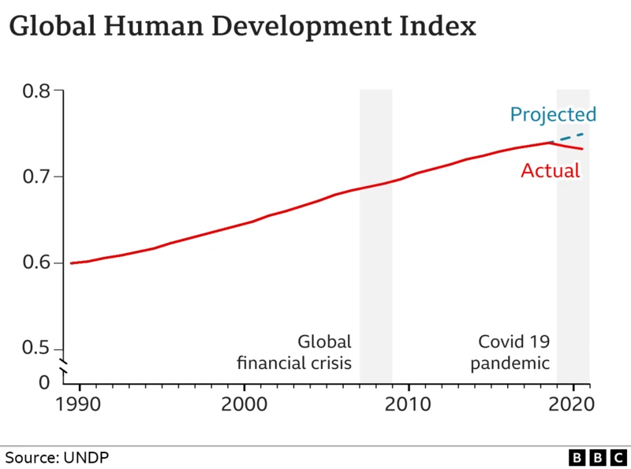

| [home page](https://sarah1giordano.github.io/Giordano-Data-Viz/)| [critique by design](critique-by-design) | [final project I](final-project-part-one) | [final project II](final-project-part-two) | [final project III](final-project-part-three) |
 
# Title
Text here...

_For each step below, you should document your progress as you move forward.  In terms of tone, think of the writeup as though you're keeping journal of your step-by-step process.   You should include a any insights you gained from the critique method, and what it led you to think about when considering the redesign.  You should talk about how you moved next to the sketches, and any insights you gleaned from your user feedback.  Document what you changed based on the user feedback in your redesign.  Finally, talk about what your redesigned data visualization shows, why you selected the data visualization you did, and what you attempted to show or do differently._

_You can include screenshots, sketches or other artifacts with your narrative to help tell the story of how you moved through the process.  Again, make sure to avoid including any personally identifying information about your interviewees (don't list full names, etc.).  While this template serves as a guide, make sure to reference the assignment writeup on Canvas for the official guidance.  This template does not include all guidance mentioned on the assignment page._

## Step one: the visualization

_Include link to the original data visualization (or screenshot - make sure to correctly cite your sources, etc.).  Include paragraph or two on why you selected this particular data visualization.  For obvious reasons, the data visualization you select should come from a publicly accessible source._

## Step two: the critique
Overall observations about the data viz. What stood out to me, what did I find worked really well? What didn't? What, if anything, would you do differently?
What worked well: One of the first messages I took away from the visualization was that, overall, HDI declined in 2020 compared to where it was projected. I felt like this was clearly communicated based on the different colors of the projected and actual lines and the dashed line for projected HDI. This worked well in the visual, and led me to score the visual highly for perceptibility. It was also intuitive to read; they did not try to use a fancy visual to convey trend over time when a line graph, which many of us can quickly read, would do. The design choice of using a dashed line for projected HDI was also intuitive. 

The lack of gridlines, simple color scheme, and minimal detail also worked well aesthetically, allowing me to quickly understand the visual. I do wish that aesthetically, it was a little more beautiful (perhaps with a better typeface), but overall, this was neither ugly nor beautiful and the aesthetic choices increase understandability instead of detract from it. 

What did not work well: The bars for the global financial crisis and the Covid 19 pandemic also stood out to me. This did not work quite as well; while it was clear that they wanted to convey that these time points were important in terms of Global Human Development, only the Covid 19 pandemic was associated with a clear change in HDI. I was left wondering why they bothered to highlight the global financial crisis. Was it to convey that HDI overall didn't decrease during the crisis, contrary to expectations? Or was it included because for some countries, this did have a negative impact (and we just cannot see this because the data are aggregated?)  This lack of clarity is part of the reason why I scored the usefulness and completeness of the visualization as only moderate (5). 

In general, I wish there had been more information to support a deeper level of understanding. There was very minimal information included in the visual compared to the article, which noted that "nine out of ten countries have slid backwards." It would have been helpful to see the disparities and differences in the line graph, without so much information that it becomes overwhelming. Greater context for the visual would have been helpful as well: I assumed that this "actual" line was a global average for HDI, but this isn't confirmed in the visual. If it is in fact an average, they could have noted this in the title. If it is an average, context across the line for the outward bounds (the highest and lowest HDI at each time point) could have helped give context for the range between different countries as well, without needing to specify each country on the visual. These thoughts contributed to my score of 5 for both usefulness and completeness. It also contributed to my score of 4 for engagement; as a reader, I wanted to engage more with the visual, but it did not include enough information for me to engage with it past the first two ideas. I found myself curious and searching for more understanding without avenues to do so. 

It also stood out to me that the y axis jumps from 0 to .5. While they do mark this jump, in general, I think the visual would be more truthful if it is shown fully at scale. To improve the truthfulness, I would have changed the y axis to start at 0 and increase steadily at .1 or .2 ticks. 

Who is the primary audience for this tool? Do you think the viz is effective for reaching that audience? Why or why not?
I think the audience is a general audience not necessarily well versed in the UN's Human Development Index but interested in global issues. The audience is also likely mostly readers from developed countries, primarily from the UK, given the source (BBC News). This article was more of a summary of a UN report than new analysis and does not include a call to action, so I would argue that this is intended to inform people first so they can potentially be moved to action at a later date. 

I do think this visual could be easily understood by this audience, but I'm not sure that it is effective in answering a question of "so what" for them or keeping their attention. Particularly since it was published by the BBC, maybe including a separate line showing the global average compared to the UK would have helped readers situate themselves more within the visual and connect with it. One thing that really resonated with me from the "Data is Personal" article is how much more effective visuals are when they connect to something in the reader's life, whether that be a focus on the place they live or an issue that is important to them. There aren't any details in this visual that I think a reader - from any audience - could form an emotional connection with, given how general it is. 

Final thoughts: How successful was this method at evaluating the data viz you selected? Are there measures you feel are missing or not being captured here? What would you change? Provide 1-2 recommendations on things to change in the visualization.
I did like this method of evaluating the data visualization! It forced me to think through more aspects of a successful visual than I likely would have otherwise, although I wish that alongside each ranking it would have explicitly asked for one thing that I think could be done to improve this score. I do think it also helped me see how one design choice can impact multiple elements of a visual, sometimes both positively and negatively - for example, including only one line on the graph for HDI overall helped with initial perceptibility and intuitiveness, but detracted from usefulness and completeness, in my opinion. 

As noted earlier, I think the visual could be improved by including a measure that shows differences between different countries, first and foremost. In my redesign, I would maybe also include details on the measures that make up HDI so audience members who hover over the line can get more details on what makes up HDI. 

What I would change and my recommendations:
-Change the type of visualization, either to something like the gapminder demo or to a map, so we can break out this data by country (or at the very least by region)
-Include a description of what the HDI is as a caption for the visual. The description of what goes into HDI is too long for a title, but it's something that I do expect most people who look at the visual will not know immediately (and will want to!) 
-Make the scale clearer - no jump! If I stick with something scaled like the gapminder visual, even if HDI values are in a range of .5 or higher, I'd recommend keeping the scale such that each increment is the same size, and there are no jumps. 
-Since HDI has generally increased globally, I recommend switching to percent change in HDI, so we can see differences in slope (this would maybe solve my questions about the global financial crisis earlier - maybe HDI didn't decrease globally, but growth did slow down, which is hard to see from just the HDI value itself.) This would still give us information on whether HDI is improving or not (e.g., the direction it is heading) but would show a lot more nuance in how quickly it is changing. 

## Step three: Sketch a solution

Sketch #1

<noscript></noscript><object class='tableauViz'  style='display:none;'><param name='host_url' value='https%3A%2F%2Fpublic.tableau.com%2F' /> <param name='embed_code_version' value='3' /> <param name='site_root' value='' /><param name='name' value='TSWDCritiquebyDesign&#47;HDIShowingRelativeImprovement' /><param name='tabs' value='no' /><param name='toolbar' value='yes' /><param name='static_image' value='https:&#47;&#47;public.tableau.com&#47;static&#47;images&#47;TS&#47;TSWDCritiquebyDesign&#47;HDIShowingRelativeImprovement&#47;1.png' /> <param name='animate_transition' value='yes' /><param name='display_static_image' value='yes' /><param name='display_spinner' value='yes' /><param name='display_overlay' value='yes' /><param name='display_count' value='yes' /><param name='language' value='en-US' /><param name='filter' value='publish=yes' /></object>
                

Sketch #2

<noscript></noscript><object class='tableauViz'  style='display:none;'><param name='host_url' value='https%3A%2F%2Fpublic.tableau.com%2F' /> <param name='embed_code_version' value='3' /> <param name='site_root' value='' /><param name='name' value='TSWDCritiquebyDesign&#47;MapOption1' /><param name='tabs' value='no' /><param name='toolbar' value='yes' /><param name='static_image' value='https:&#47;&#47;public.tableau.com&#47;static&#47;images&#47;TS&#47;TSWDCritiquebyDesign&#47;MapOption1&#47;1.png' /> <param name='animate_transition' value='yes' /><param name='display_static_image' value='yes' /><param name='display_spinner' value='yes' /><param name='display_overlay' value='yes' /><param name='display_count' value='yes' /><param name='language' value='en-US' /><param name='filter' value='publish=yes' /></object>
                

## Step four: Test the solution

_Before you conduct your interviews, prepare a simple script.  Use this as a guide and as a way to take notes as you go forward. Come up with your own list of questions you want to ask for the selected visualization. Keep the questions broad so you can get the most value out of your feedback. Then, document answers to your questions here._

Interview #1:
1)

-year more prominent, maybe overlayed on the graph bc it’s hard to tell as it changes
-explain somewhere what HDI is
-change the subtitle from 9/10 to 90% so people don’t feel like there are only 10 countries
-labels don’t actually need HDI number, maybe just the country
-labels are highest and lowest HDI
-not broken out enough for them to draw any surprising conclusions
-could be interesting to examine which countries continued to decline and if there are any trends
    life expectancy is a component of HDI? feels weird to plot them against one another if so, because obviously they are correlated
label on difference from previous year was confusing, need to add “from previous year”
dual axis is confusing to them, as it is redundant
Like the first one better - a little more intuitive, but maybe as a map, because then you could also see geographic clusters

Interview #2: 
Review of map:

-Looks good - was initially searching for the definition of HDI, but then saw it at the bottom
-Can explore the changes over the years even in regions, over the years
-Liked being able to click on different countries and see different stats, that you could see which areas it went up in and where it went down because globally it might not show that
-remove the show history button, that isn't intended to show up
-There's a lot to click through! Initially, I had this loaded as starting at the earliest data point, but
-Saw COVID... but only after prompted to click through!
-Noticed that there were no global trends largely until COVID, one country would go backwards but then it'd get better the next year, and maybe another country would decline

Questions to ask (modify these for your own interviews): 

- Can you tell me what you think this is?

- Can you describe to me what this is telling you?

- Is there anything you find surprising or confusing?

- Who do you think is the intended audience for this?

- Is there anything you would change or do differently?

Results: 

_Don't identify or share personally identifiable information (PII) about the people you spoke to._

| Question | Interview 1 | Interview 2 |
|----------|-------------|-------------|
|          |             |             |
|          |             |             |
|          |             |             |

Synthesis: 

_What patterns in the feedback emerge?  What did you learn from the feedback?  Based on this feedback, come up with what design changes you think might make the most sense in your final redesign._

## Step five: build the solution

<noscript></noscript><object class='tableauViz'  style='display:none;'><param name='host_url' value='https%3A%2F%2Fpublic.tableau.com%2F' /> <param name='embed_code_version' value='3' /> <param name='site_root' value='' /><param name='name' value='TSWDCritiquebyDesign&#47;MapOption2' /><param name='tabs' value='no' /><param name='toolbar' value='yes' /><param name='static_image' value='https:&#47;&#47;public.tableau.com&#47;static&#47;images&#47;TS&#47;TSWDCritiquebyDesign&#47;MapOption2&#47;1.png' /> <param name='animate_transition' value='yes' /><param name='display_static_image' value='yes' /><param name='display_spinner' value='yes' /><param name='display_overlay' value='yes' /><param name='display_count' value='yes' /><param name='language' value='en-US' /><param name='filter' value='publish=yes' /></object>
                

_Include and describe your final solution here. It's also a good idea to summarize your thoughts on the process overall. When you're done with the assignment, this page should all the items mentioned in the assignment page on Canvas(a link or screenshot of the original data visualization, documentation explaining your process, a summary of your wireframes and user feedback, your final, redesigned data visualization, etc.)._

