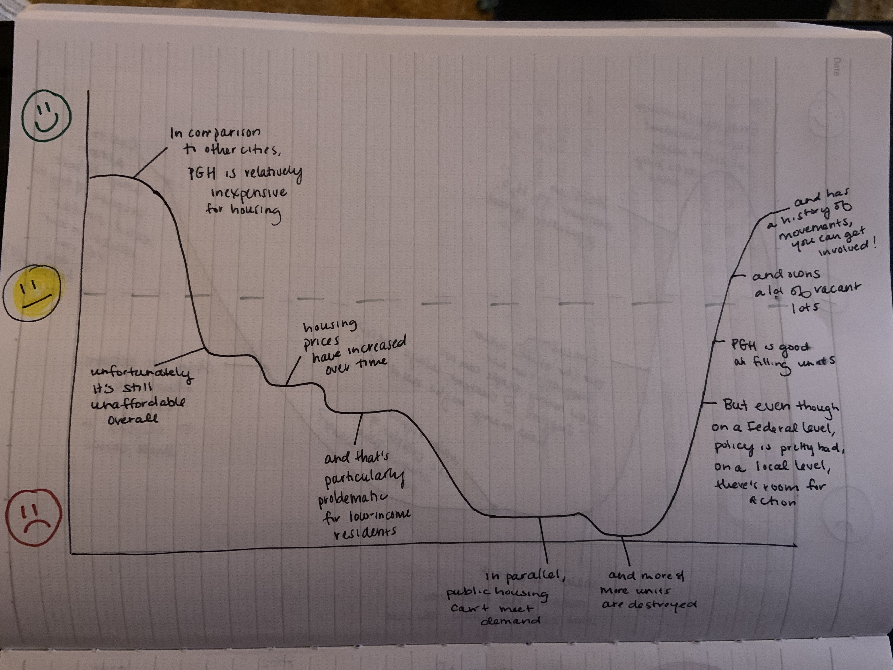
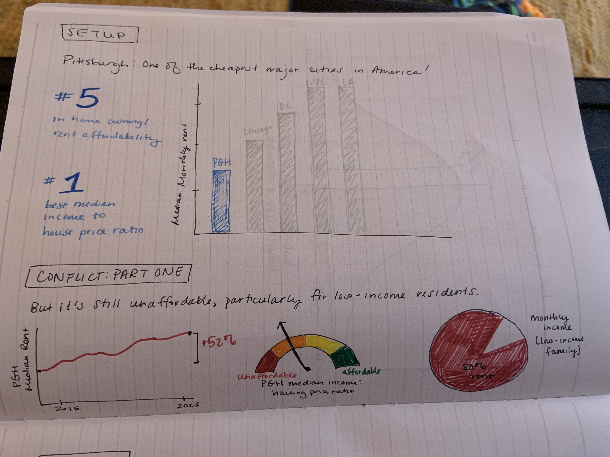
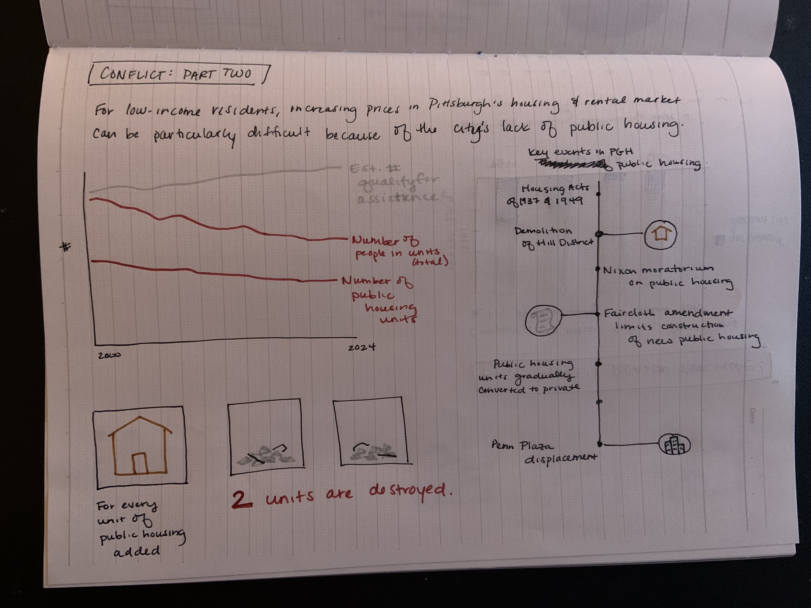
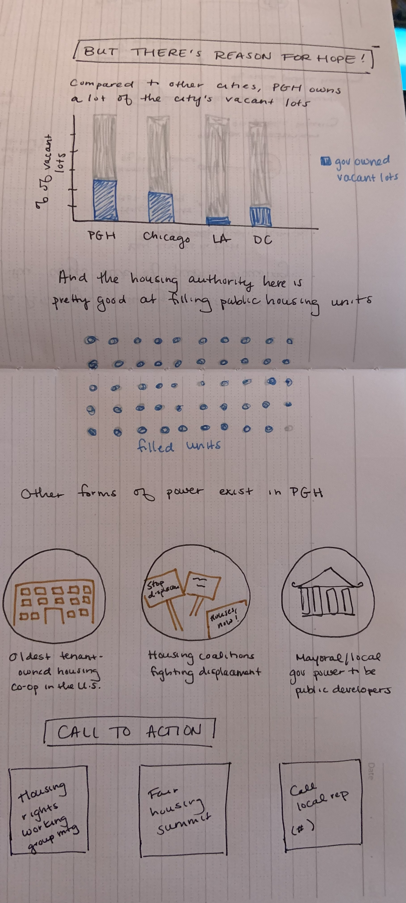

| [home page](https://sarah1giordano.github.io/Giordano-Data-Viz/)| [critique by design](critique-by-design) | [final project I](final-project-part-one) | [final project II](final-project-part-two) | [final project III](final-project-part-three) |  

# Outline

When I moved here from Washington D.C., one of the first things that I said to my friends was "the rent is so cheap here!" That's been my experience with a lot of young professional transplants to Pittsburgh, who are thrilled that for once they can afford a one bedroom by themselves, and can maybe even see themselves buying a home one day if they were to stay in the area. It has only been through talking to people who have been in Pittsburgh for much longer than I have that I have learned how dramatically Pittsburgh's rental prices have increased over the past ten years. The city is - and always has been - unaffordable for it's lower-income residents, and Pittsburgh (like many other major cities) also has a history of displacing low-income neighborhoods, particularly Black residents, in favor of private developers. 

I'm interested in showing this different story of Pittsburgh's affordability for my project. My proposed outline is as follows:

-Setup ("Pittsburgh's cheap!"): Similar to how I first reacted when I moved to Pittsburgh from a more expensive city, and how many of the people I know who don't live in Pittsburgh react when hearing about rent prices here, I will present Pittsburgh as a relatively affordable city. It's ranked as one of the cheapest in the country, and rental prices for a one bedroom here are often much cheaper than in other cities.

-Conflict, Part one ("Whoops, it's actually not affordable"): Pittsburgh has been called cheap and ranks highly in affordability but only *in comparison to other cities*. When you dig into the data, you find that the ratio between median income to housing costs in Pittsburgh still makes it relatively unaffordable. The problem right now is that there is no major city that is in fact affordable. Pittsburgh is simply one of the best in a field of entirely bad options. Like other cities, Pittsburgh's housing costs have also increased dramatically over the past decade. 

-Conflict, Part two ("...particularly for low-income people"): In parallel, as costs have risen, options for public housing in Pittsburgh have declined. The city has destroyed many public housing units, sold land to private developers and displaced long-time residents (particularly Black residents). Over the years, a smaller share of Pittsburgh residents who qualify for public housing assistance are able to get that support, and the Federal government is prohibited from building new public housing.

-Resolution ("There are positive opportunities at a local level"): Compared to other cities, Pittsburgh is actually in a better starting position to develop new housing options and meet the crisis, because the government owns a decent amount of the vacant lots already. The Public Housing Authority here also appears to be pretty good at quickly filling existing public housing units when they become available. There's a history of activism around housing in Pittsburgh and while at the Federal level, the government cannot build more public housing, local governments can. 

-Call to action: These changes affect all of us, because they drastically change who can afford to live in Pittsburgh and who our neighbors are. Even if you're not a low-income resident, you've seen your rent increase, and there's nothing stopping your landlord from increasing it further or selling the property to a huge developer. Get involved in safeguarding housing for everyone by attending a working group meeting and calling the mayor's office to let them know housing is a priority.

## Initial sketches

Sketch #1: Setup and part one of the conflict

Sketch #2: Part two of the conflict - in addition to what I've outlined here, I'm considering emphasizing displacement & increasing sale of properties to huge conglomerates. The second is something that should definitely concern every renter in Pittsburgh and may resonate more with my audience for this project.

Sketch #3: Hope/resolution/call to action

# The data

I've separated my overview of the data into two sections: raw data sources (open access, public use data sets) and other sources I discovered when researching for the project.

The first section includes datasets I would use to do my own analysis and generate most visuals, such as the change in median rental prices in Pittsburgh over time and the decline of public housing units in Pittsburgh. The first two sources - the Assisted Housing National and Local dataset and the American Community Survey - do not include multiple timepoints, but both sources do have publicly available datasets for each year. I was able to quickly join these tables together so that data across different timepoints is in the same file for ease of analysis. These sources include data not only for Pittsburgh but for other cities, allowing me to do cross-city comparisons for context. Using these datasets, I should be able to gneerate visuals such as a line chart showing Pittsburgh's median rent over time, a bar chart showing Pittsburgh's median rent in 2023 compared to other major U.S. cities, line charts showing the number of people in affordable housing and number of affordable housing units in Pittsburgh over time. By combining key data from each dataset, I can also show what proportion of a low-income Pittsburgh resident's monthly income (Assisted Housing dataset) would go towards rent, if they were paying the median rent price (American Community Survey). 

The second section includes other sources I would use for context, to supplement analysis, or for callout boxes with key statistics. For example, using these resources for context, I hope to create a visual showing where Pittsburgh's median rent falls on a scale from "unaffordable" to "affordable" (using the median household income to rent ratio). I'd like to adapt timelines of housing from a Federal focus to a Pittsburgh-specific context, combining important Federal events with important Pittsburgh events such as the demolition of neighborhoods in the Hill District and the Penn Plaza displacement. These sources also have interesting data on the rate of decline of public housing and the percent of vacant lots owned by the city government that I plan to adapt into visuals.

## Raw data sources 

| Name | Source | URL | Description |
|------|-----|-------------|
| Assisted Housing: National and Local Data | U.S. Department of Housing and Urban Development’s Office of Policy Development and Research| https://www.huduser.gov/portal/datasets/assthsg.html#data_2009-2023 | Includes data on how Federal government dollars are used to support low-income renters, by year. Relevant data points include: number of public housing units, percent of units occupied, total people supported, average rent per month, average household income per month, and demographic makeup of individuals |
| American Community Survey | U.S. Census Bureau | https://data.census.gov/table?q=median%20gross%20rent&g=050XX00US42003&y=2023 | Includes data on median gross rent by county, by year. Since 2015, these data also include a breakdown of median gross rent by number of bedrooms as well. |

## Other sources to potentially use for context

| Name | Source | URL | Description |
|------|-----|-------------|
| Public Housing Data Dashboard | U.S. Department of Housing and Urban Development | https://www.hud.gov/program_offices/public_indian_housing/programs/ph/PH_Dashboard | Includes an overview of key data points related to Federal funding for public housing and progress towards targets. |
| The Hill District: A community holding on through displacement and development | PublicSource | https://www.publicsource.org/hill-district-displacement-development/ | Overview of displacement of Hill District residents |
| Power Play Goal | Georgetown Law | https://www.law.georgetown.edu/poverty-journal/wp-content/uploads/sites/25/2022/07/Power-Play-Goal-.pdf | Details on the displacement of Hill District residents |
| Key Moments in the Penn Plaza Displacement Drama | PublicSource | https://www.publicsource.org/key-moments-in-the-penn-plaza-displacement-saga/ | Overview of the Penn Plaza displacement |
| Public Housing History | National Low Income Housing Coalition | https://nlihc.org/resource/public-housing-history | Overview of key events in public housing history in the U.S. |
| Pittsburgh Housing Needs Assessment: Final Report | City of Pittsburgh | https://apps.pittsburghpa.gov/redtail/images/21887_Pittsburgh_HNA_Final_Report.pdf | Overview of the housing needs assessment in Pittsburgh 2015-2019 |
| Historical Context | Lots to Love | https://www.lotstolove.org/about/ | Overview of vacant lots ownership in City of Pittsburgh
| A Brief Historical Overview of Affordable Rental Housing| National Low Income Housing Coalition | https://nlihc.org/sites/default/files/Sec1.03_Historical-Overview_2015.pdf | Overview of the decline of affordable housing over time with suggestions for the future, including key data points and callout statistics. |
| Demographia International Housing Affordability 2024 | Chapman University | http://www.demographia.com/dhi.pdf | Study of housing affordability in cities across 94 major housing markets. |
| 2024 Most Affordable Places to the Live in the U.S.: 100 Cities, Ranked | Clever | https://listwithclever.com/research/most-affordable-places-to-live-in-the-us-2024/#ranked | Based on real estate data, ranking of affordability based on home and rent prices compared to median income in the area. |

# Method and medium

I plan to use Shorthand and Tableau for my project. I'm not entirely sure what Shorthand is capable of yet: based on the in-class preview of past projects, it's clear that it can handle timelines quite well, but I'm not sure if it will allow me to develop some of the more "design" visuals that I've proposed, such as icons to help visualize the destruction of public housing or the history of housing activism in Pittsburgh. If it can't handle this, I've been able to design pretty simply visuals similar to this just using PowerPoint before. 

