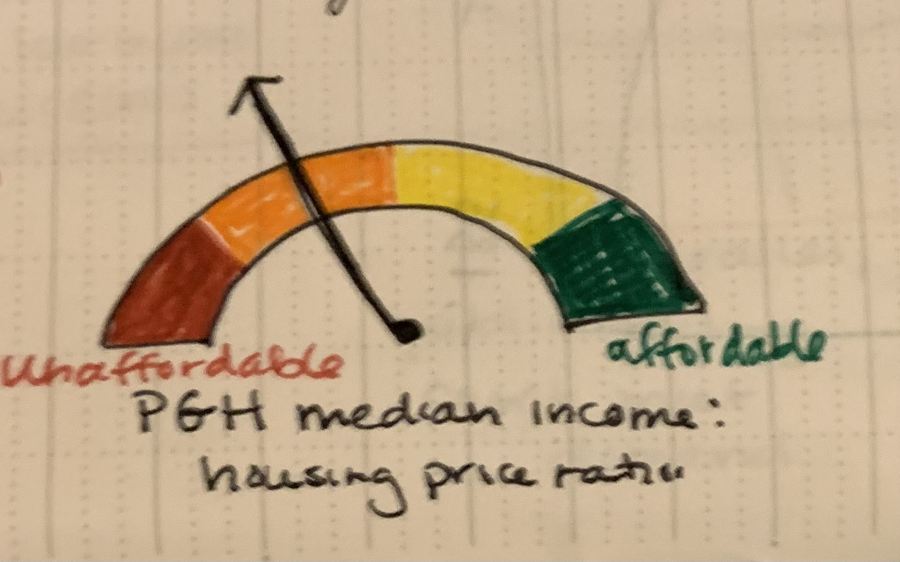
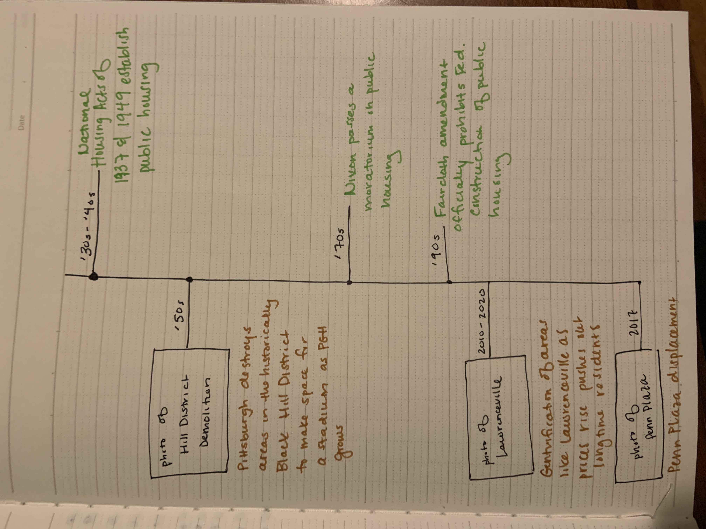
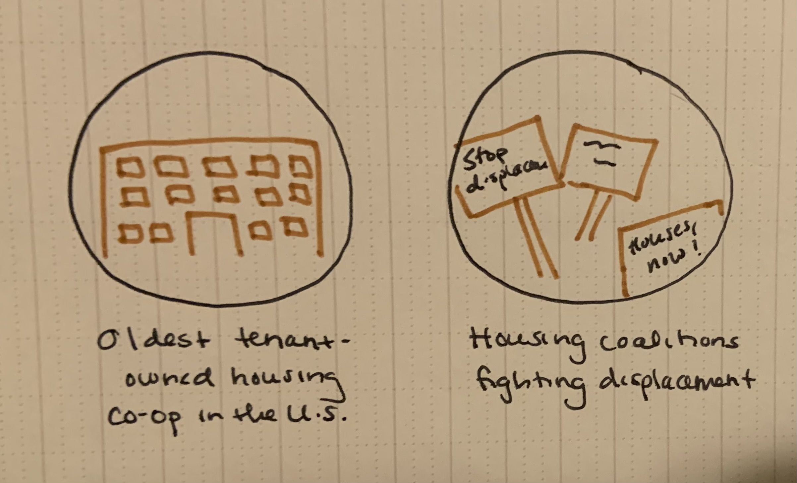

| [home page](https://sarah1giordano.github.io/Giordano-Data-Viz/) | [visualizing government debt](visualizing-government-debt) | [critique by design](critique-by-design) | [final project I](final-project-part-one) | [final project II](final-project-part-two) | [final project III](final-project-part-three) |

# Wireframes / storyboards

Based on my sketches from the first part of the project, I developed five draft data visualizations using the raw data from the U.S. Census' American Community Survey and the U.S. Department of Housing and Urban Development’s Office of Policy Development and Research's Assisted Housing datasets. Two of these visualizations are part of the proposed "set up" of my story, and three are part of the "conflict" of my story. I also tweaked my story set up slightly based on the feedback I received from classmates the week of 11/19. 

I opted to set up my storyboard on Github (below) for the time being. Because I'm new to Shorthand, I didn't feel confident turning something around for my testers in time on that platform - but I also knew I wanted to move past the purely hand drawn storyboard and start testing some data visualizations in Tableau. Incorporating narrative, some hand drawn elements, and data visualizations on Github allowed me to still give my testers a sense of the narrative.

## Setup

(Photo by Vidar Nordli-Mathisen on Unsplash)

Callout statistics highlight that Pittsburgh is currently ranked #5 in the U.S. in home owning/rent affordability and #1 across the U.S., Canada, U.K., Australia, New Zealand, China, and Japan for the best median income to house price ratio.

Visualization #1

<noscript></noscript><object class='tableauViz'  style='display:none;'><param name='host_url' value='https%3A%2F%2Fpublic.tableau.com%2F' /> <param name='embed_code_version' value='3' /> <param name='site_root' value='' /><param name='name' value='FinalProjectPart2-PGHRentComparedtoTop5MSAs&#47;Sheet1' /><param name='tabs' value='no' /><param name='toolbar' value='yes' /><param name='static_image' value='https:&#47;&#47;public.tableau.com&#47;static&#47;images&#47;Fi&#47;FinalProjectPart2-PGHRentComparedtoTop5MSAs&#47;Sheet1&#47;1.png' /> <param name='animate_transition' value='yes' /><param name='display_static_image' value='yes' /><param name='display_spinner' value='yes' /><param name='display_overlay' value='yes' /><param name='display_count' value='yes' /><param name='language' value='en-US' /><param name='filter' value='publish=yes' /></object>
               

[Source](https://data.census.gov/table?q=median%20gross%20rent&g=050XX00US42003&y=2023)

Visualization #2

<noscript></noscript><object class='tableauViz'  style='display:none;'><param name='host_url' value='https%3A%2F%2Fpublic.tableau.com%2F' /> <param name='embed_code_version' value='3' /> <param name='site_root' value='' /><param name='name' value='FinalProjectPart2-PGHRentComparedtoRustBeltCities&#47;Sheet1' /><param name='tabs' value='no' /><param name='toolbar' value='yes' /><param name='static_image' value='https:&#47;&#47;public.tableau.com&#47;static&#47;images&#47;Fi&#47;FinalProjectPart2-PGHRentComparedtoRustBeltCities&#47;Sheet1&#47;1.png' /> <param name='animate_transition' value='yes' /><param name='display_static_image' value='yes' /><param name='display_spinner' value='yes' /><param name='display_overlay' value='yes' /><param name='display_count' value='yes' /><param name='language' value='en-US' /><param name='filter' value='publish=yes' /></object>
               

[Source](https://data.census.gov/table?q=median%20gross%20rent&g=050XX00US42003&y=2023)

## Conflict storyboard and visualizations (middle part of story)

While the vision of Pittsburgh is of an affordable city, much like most of the country, prices have quickly been increasing over time. 

Visualization #3

<noscript></noscript><object class='tableauViz'  style='display:none;'><param name='host_url' value='https%3A%2F%2Fpublic.tableau.com%2F' /> <param name='embed_code_version' value='3' /> <param name='site_root' value='' /><param name='name' value='FinalProjectPart2-PGHRentOverTime&#47;PGHRentOverTime' /><param name='tabs' value='no' /><param name='toolbar' value='yes' /><param name='static_image' value='https:&#47;&#47;public.tableau.com&#47;static&#47;images&#47;Fi&#47;FinalProjectPart2-PGHRentOverTime&#47;PGHRentOverTime&#47;1.png' /> <param name='animate_transition' value='yes' /><param name='display_static_image' value='yes' /><param name='display_spinner' value='yes' /><param name='display_overlay' value='yes' /><param name='display_count' value='yes' /><param name='language' value='en-US' /><param name='filter' value='publish=yes' /></object>
                

[Source](https://data.census.gov/table?q=median%20gross%20rent&g=050XX00US42003&y=2023)

And while it is highly ranked, that doesn't mean much if it's only the best of a bad situation. The same report that ranked Pittsburgh as #1 in terms of the best median to house price ratio also notes that the ratio is still what they qualify as "unaffordable." 

As prices increase, those who make a median income in Pittsburgh might find their budget looks a little tighter. Those who are lower-income, though, might find that they have been priced out entirely.

Pittsburgh - like the rest of the nation - has a long history of displacing long-time residents, particularly Black residents, as prices increase and areas gentrify. And in tandem, like the rest of the country, it has also gradually lost more and more of its public housing as the value of real estate becomes more lucrative. 

Timeline visual (will eventually be in Shorthand!) of displacement and public housing events:

Visualization #4

<noscript></noscript><object class='tableauViz'  style='display:none;'><param name='host_url' value='https%3A%2F%2Fpublic.tableau.com%2F' /> <param name='embed_code_version' value='3' /> <param name='site_root' value='' /><param name='name' value='FinalProjectPart2-PGHPublicHousingOverTime&#47;Sheet1' /><param name='tabs' value='no' /><param name='toolbar' value='yes' /><param name='static_image' value='https:&#47;&#47;public.tableau.com&#47;static&#47;images&#47;Fi&#47;FinalProjectPart2-PGHPublicHousingOverTime&#47;Sheet1&#47;1.png' /> <param name='animate_transition' value='yes' /><param name='display_static_image' value='yes' /><param name='display_spinner' value='yes' /><param name='display_overlay' value='yes' /><param name='display_count' value='yes' /><param name='language' value='en-US' /><param name='filter' value='publish=yes' /></object>
      

[Source](https://www.huduser.gov/portal/datasets/assthsg.html#data_2009-2023)

Visualization #5

<noscript></noscript><object class='tableauViz'  style='display:none;'><param name='host_url' value='https%3A%2F%2Fpublic.tableau.com%2F' /> <param name='embed_code_version' value='3' /> <param name='site_root' value='' /><param name='name' value='FinalProjectPart2-PGHMedianRentcomparedtoIncome&#47;Sheet1' /><param name='tabs' value='no' /><param name='toolbar' value='yes' /><param name='static_image' value='https:&#47;&#47;public.tableau.com&#47;static&#47;images&#47;Fi&#47;FinalProjectPart2-PGHMedianRentcomparedtoIncome&#47;Sheet1&#47;1.png' /> <param name='animate_transition' value='yes' /><param name='display_static_image' value='yes' /><param name='display_spinner' value='yes' /><param name='display_overlay' value='yes' /><param name='display_count' value='yes' /><param name='language' value='en-US' /><param name='filter' value='publish=yes' /></object>
        

[Source 1](https://data.census.gov/table?q=median%20gross%20rent&g=050XX00US42003&y=2023), [Source 2](https://www.huduser.gov/portal/datasets/assthsg.html#data_2009-2023)

Today, this means that many long-time residents, low-income residents, and people of color can no longer afford to live in Pittsburgh or are only able to find housing in particular neighborhoods. As prices continue to increase, even middle-class residents and students are being driven to look for more affordable housing as well, sometimes leading to these residents entering new areas and beginning to price out their neighbors once again. 

## But there's reason for hope! (Conclusions and call to action)

We're all affected by increasing home and rent prices in Pittsburgh. But unlike cities like New York, where nearly every square inch of space already seems to be in use, or cities like L.A., where most vacant lots are owned privately by individual owners or multinational corporations, Pittsburgh both has a lot of space and relatively more local government ownership of vacant lots. 

Pittsburgh also has a strong history of community activism around housing that can benefit all of us, even those of us not looking for public housing. 

(I plan to also include some callout quotes here from people involved in the fair housing movement in Pittsburgh about what it means to be a good neighbor, what these neighborhoods mean to them.)

To get involved, not only to lower your own rent but to protect the ability of all types of people to live in Pittsburgh, follow one of the action items below. (Ideally, I'll design this using QR codes too so people can scan them and be directed to the appropriate link).

1. Come to the next housing rights working group meeting and connect with other students from CMU and Pitt that are interested in housing justice!
2. Attend Pittsburgh's Fair Housing Summit
3. Call your local representative to let them know that prices are too high - and that housing is an issue that they must take care of!

# User research 

## Target audience

First and foremost, I wanted to test my visaulizations with individuals somewhat similar to the audience for my final presentation. This meant identifying representatives who are highly educated and/or interested in public policy and data analysis; who are between roughly 22-35; and who have some familiarity with Pittsburgh but are not long-time residents of Pittsburgh. (Luckily, I know a lot of people in Pittsburgh or somewhat connected to Pittsburgh that fit this profile, so I planned to recruit from my friends.) While some students at Heinz grew up in Pittsburgh, the majority of us are new to the city and have not developed as much local context yet. I wanted to make sure that these visualizations still resonated with those "new" to Pittsburgh and who are (likely) not currently thinking as much about housing long-term in Pittsburgh as they are about other issues in their lives. Does the story still resonate? What do they take away from it - and is it what I hoped they would take away? Do the visuals leave them thinking "so what?" or "what does that have to do with me?"

## Interview script

The goals for my user research were as follows: 

1. Understand whether the elements of the story come through clearly when using just the visuals, even without narrative. If someone is scrolling through my Shorthand page, the likelihood that they will read every word of text is low. The likelihood that they'll look at the visuals is higher. I want to make sure that if someone is just scrolling, they can still get the gist of what I'm trying to say.
   
2. Understand which visuals are the most valuable and which could I might be better off removing. I proposed a lot of visuals in the first part of this project, and I know that not all of them will work. In fact, if some of them are less successful, they might actually distract the reader and take away from the points that I'm trying to make. I want to keep the story focused and make sure each visual I include adds something.

3. Determine whether the visuals connect with my audience at all - and if not, what might help them connect to the story more. I'm doing my project on housing in Pittsburgh. While all of the audience members for my final presentation participate in the housing market in Pittsburgh in some way, students are often less invested in housing than longer-time residents, because students are more transient. How can I connect with that audience?

4. Do typical wireframing/testing to understand if the visuals were clear, user-friendly, and if there were any tweaks necessary to make them better during a redesign process.

In keeping with these goals, I asked the following questions of each interviewee:

| Goal | Questions to Ask |
|------|------------------|
|  1    | Looking through the five visualizations, what do you think is the "story" that I am telling? |
|  1    | What is your main takeaway? (If you had to sum your thoughts up in one sentence, what would it be)? |
|  1   | Is there anything that you think is missing from this story, as it is told through visuals currently? |
| 2 | What was your favorite visual from the set-up section (visual #1 & #2)? Why? |
| 2 | What was your least favorite visual from the set-up section (visual #1 & #2)? Why? |
| 2 | What was your favorite visual from the conflict section (visual #3-5)? Why? |
| 2 | What was your least favorite visual from the conflict section (visual #3-5)? Why? |
| 3 | How did the visuals make you feel? |
| 4 | What (if anything) confused you about these visualizations? |
| 4 | What would you change about these visuals? Could be something specific to one visual, could be something about several of them. |

## Interview findings

I conducted three interviews, all with individuals in their mid to late 20s that fit the description of my target audience (new transplants to Pittsburgh and/or people who frequently visit Pittsburgh but are not originally from the city, highly educated, interested in public policy issues). 

| Interview question(s)   | Interview 1 (28, Masters in Education, currently lives in DC but frequently in Pittsburgh and originally from Michigan) | Interview 2 (28, MPP, has lived in Pittsburgh for 4+ years but originally from Chicago) | Interview 3 (26, MPP, currently lives in Philadelphia but experience in Pittsburgh, Chicago, and DC) |
|-------------------------|--------------------------------|-------------|-------------|
| What's the story, what's your main takeaway, and what's missing? (Q1-3 in table above) | Their takeaway was that while Pittsburgh may have lower rents than comparable cities, rents have still increased rapidly, and there is a gap between housing needs and services provided. Without the narrative piece, they felt that the link between the first two visuals (setup visuals) and the second sets of data (rampant housing insecurity) has to be made by the viewer, but they also felt it fit the set up/conflict format well. | Their takeaway was that Pittsburgh has long been one of the most affordable cities in the U.S. in terms of housing, but costs have risen steeply over the past decade while affordable housing has declined. They noted a second thought they were walking away with that they inferred from the data but didn't see directly - that lower income people may be getting pushed out of Pittsburgh due to housing prices and that Pittsburgh may not remain affordable for long. They were interested to see more narrative, human interest in the story that puts a "face to the story", so they were excited to hear I planned to incorporate that in the narrative sections. They also noted it would be good to understand where displacement is occuring, where those displaced residents are going, and what might be driving cost increases in Pittsburgh. They remembered a news piece about gentrification in Pittsburgh that they suggested I look for, which was a great suggestion! |  Their takeaway overall was there is a lack of affordable housing in Pittsburgh, and this gap is widening. They noted that they were left curious about the impact of COVID on this story - particularly given the sharp increase in visual #3 starting in 2020 - and any additional visualization of income over time. They think what's missing from the story is that in the conflict section, we lose any point of reference to other cities - it would have been helpful for them to potentially see other city comparisons in income and/or over time. |
| What's your favorite visual from setup? Why? | Visual #2 - they felt it was a more useful comparison since the cities were more comparable. | Visual #2 - they noted that Pittsburgh isn't comparable in many ways to coastal cities. They thought it was interesting to see that even among midsized cities with similar economic histories, it's still one of the most affordable. | They noted both in the setup section were fine and conveyed the information equally well. |
| What's your least favorite visual from setup? why? | Visual # 1 - it felt less relevant than the other visual. | Visual # 1 - again, they noted that Pittsburgh isn't comparable in many ways to coastal cities, so it feels silly to even mention those cities. |  N/A - they liked both equally. |
| What's your favorite visual from conflict? Why? | Visual #3 - They thought it did a good job of showing how rapidly rents have increased, but they were left curious about how that compares to average income over the same time, for context. | Visual #4 - they thought it was really clear and "illustrated the whole concept". They also said they liked #3, but they would be interested to see some comparison to determine whether this is a normal trend among U.S. cities or a steeper increase, plus whether it was adjusted for inflation or things like that. | Their favorite in the conflict section was #5 - they thought "it's a clever way of displaying this information" and found it "compelling". | 
| What's your least favorite visual from conflict? Why? | Visual #4 - But only because it took them longer to digest, particularly without the guidance of a narrative up to that point. | Visual #5 - They described it as "weird, and seeing a bar wasn't super informative". They suggested maybe finding a way to compare it as if it were a family budget, like showing the recommended breakdown of how much of a family's income should go to certain expenses vs. how much someone earning the median income would have to pay. Or some other type of walkthrough budgeting thing where you compare how much public housing residents would have left after paying median rent to spend on the average cost of things like groceries, healthcare, etc.--to show how people in this scenario have to make hard choices between other necessities because they are rent burdened. | Visualization #4 - they said that by this point, they had started to think too much about the time frames and change over time, and they were interested in what is happening in the 2004-2007 timeframe that is displayed. They also weren't sure it was useful to see this comparison of people versus units without additional context such as household composition. At first, they thought it was going to show the number of applicants or vouchers or something else that would show a discrepancy of available units instead. |
| How did the visuals make you feel? | "Sad, but ultimately not surprised." They were interested to know what could be done/is being done to address the issue. | "Upset" and "angry". They were particularly focused on the displacement, and this resonated with them as someone who had moved to Pittsburgh and was not originally from Pittsburgh. | "Curious" - they wanted to learn more, particularly about the change over time and whether this was normal for other cities in the region too/part of a national trend. |
| What was confusing/what would you change? | Visualization #4 took them longer to process. They ultimately weren't confused, but it did take longer to digest. We conducted the interview over the phone, and they also noted that the Github site and Tableau were not super mobile friendly, so they had trouble viewing the visualizations as originally formatted. They did not have any specific changes they would suggest that we hadn't covered in other questions yet. | They thought all of them were very clear and well labeled, although they noted that for visual #1 and #2, it was "annoying to scroll to see all the bars". They found a typo in visual #3 - "project median" should be "projected median". And like they noted in their least favorites, they thought #5 was the most confusing in how it was presented. They noted it would be clearer even if it was just in the narrative or as a callout statistic. They also didn't have many changes to suggest beyond what we had covered in other questions, other than to suggest a "more fun color scheme." | They also pointed out the typo in visual #3, this briefly tripped them up. They also didn't find visualization #5 to be intuitive, but it was clearly labeled and easy to understand once they took a beat - and ended up being one of their favorites. The biggest thing that they would change would be seeing visual #3 also go back to 2000, purely out of curiousity for how it compares to #4's timeframe. Generally, they thought the visualizations looked nice, and "were very clear and to the point." |

# Identified changes for Part III

Based on my interviews, I plan to make the following adjustments:

1) Incorporating even more of the "face of the story", quotes and callout text from people who have been displaced and research on where those residents are moving. In general, I think this is my biggest takeaway.
   
2) Including a little more focus on the present day - where are residents now? What neighborhoods are rapidly changing? What are people doing in response? - will help ground the call to action section more. 

3) Focus my visuals in the set up section on the most comparable cities - 2/3 interviewees agreed that the Rust Belt comparison was far more helpful than the major cities comparison, and I'm inclined to agree with them. I may end up tweaking this to include another bar with the national average as a reference point as well, since there was an interest in more reference points.

4) Tweak my line graph of visual #3 to give a comparison to the national average. I haven't dug into whether Pittsburgh's rate of increase is similar to the national average or not, and I should do some of that analysis to either include an appropriate reference line or to provide appropriate context narratively for the visual. If it has been increasing more than the national average, that would certainly be interesting to show.

5) I may break visual #4 into side-by-side line charts instead of including both these lines on the same visual. While I want the analysis to be paired together, this did confuse 2/3 interviewees, and I can understand why.

6) I think I'm going to jettison visual #5 - while only one interviewee brought up issues with this visual, and it was the favorite for another visual, I was already having doubts about it. I think this could probably be better communicated as a callout statistic like "The median rent in Pittsburgh is 80% of what low-income residents earn monthly".

In general, the feedback that resonated the most with me and is my biggest takeaway from this process is to focus on the real people behind the data. That, rather than the raw data, is the real heart of the story and will move people the most. Including some narrative elements and photos (if any historical photos are free to use) will help make the point that this is a real issue happening to real people.

Feedback I do not plan to incorporate:

1) A focus on COVID. I don't think that's the story I want to tell here, and I think ultimately it would distract from a pretty straightforward narrative.
   
2) Mobile friendliness. This is just not a challenge I'm prepared to take on, given the time frame, but it would be interesting to adapt to mobile devices in the future!
